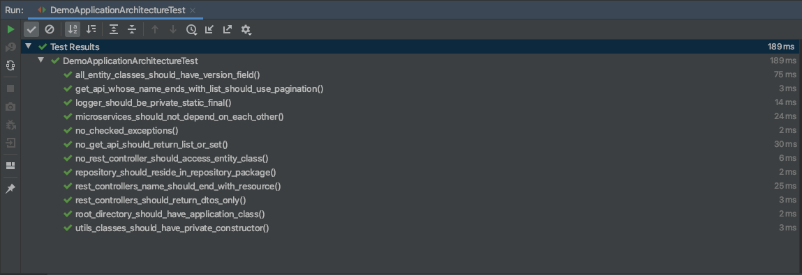
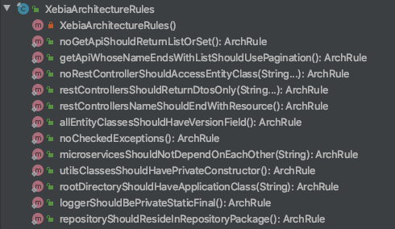

# xebia-archunit-extension


A test library built on top of ArchUnit. It codifies best practices that we use at Xebia in our Java Spring Boot projects.

Following are the rules that this library adds:

1. No Get API should return List or Set
2. Enforce pagination to avoid performance issues
3. Entities should not be directly exposed in the REST controllers
4. REST controllers should return DTOs only
5. REST controllers name should end with `Resource`
6. All `@Entity` classes should have `@Versioned` field
7. Favor Unchecked exception over checked exception
8. Utils class should have private constructor
9. Root package should have `Application` class
10. Slf4j Logger should be `private static final`
11. Repository interfaces should be inside `..repository..` package

We will keep adding more tests to this repository.

## Usage

For Maven users first add the repository to your pom.xml

```xml
 <repository>
    <id>github</id>
    <name>GitHub Packages</name>
    <url>https://maven.pkg.github.com/xebia-os/xebia-archunit-extension</url>
</repository>
```

Then add the following library to your Maven pom.xml

```xml
<dependency>
  <groupId>com.github.xebia</groupId>
  <artifactId>archunit-extension</artifactId>
  <version>0.1.0</version>
  <scope>test</scope>
</dependency>
``` 

if you use Gradle then add following

```
testImplementation("com.github.xebia:archunit-extension:0.1.0")
```

Once you have added the library you can use it in two ways.

### Approach 1: Extending `com.github.xebia.archunit.AbstractArchitectureTests` class

Create a new test class extending `com.github.xebia.archunit.AbstractArchitectureTests` class. 
This will add all the test cases.

```java
import com.example.demo.domain.UserEntity;
import com.github.xebia.archunit.AbstractArchitectureTests;
import com.tngtech.archunit.core.importer.ClassFileImporter;
import com.tngtech.archunit.core.importer.ImportOption;

class DemoApplicationArchitectureTest extends AbstractArchitectureTests {


    public DemoApplicationArchitectureTest() {
        super(new ClassFileImporter()
                        .withImportOption(ImportOption.Predefined.DO_NOT_INCLUDE_TESTS)
                        .importPackagesOf(Application.class),
                new String[]{UserEntity.class.getPackage().getName()},
                "com.example.(*service).domain",
                Application.class.getPackage().getName(), "Dto");
    }
}
```

You can the run your test class and all the test will run.



### Approach 2: Write your own test class and pick the test you want to run

All the rules are in `com.github.xebia.archunit.rules.XebiaArchitectureRules` class. 

So, you can directly import it and use them.

 

